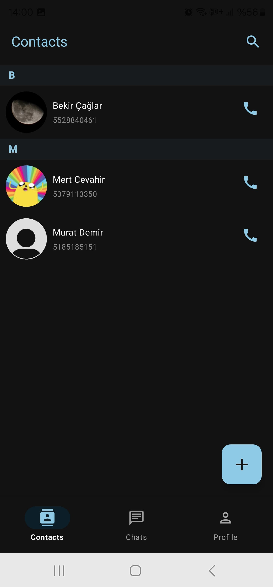
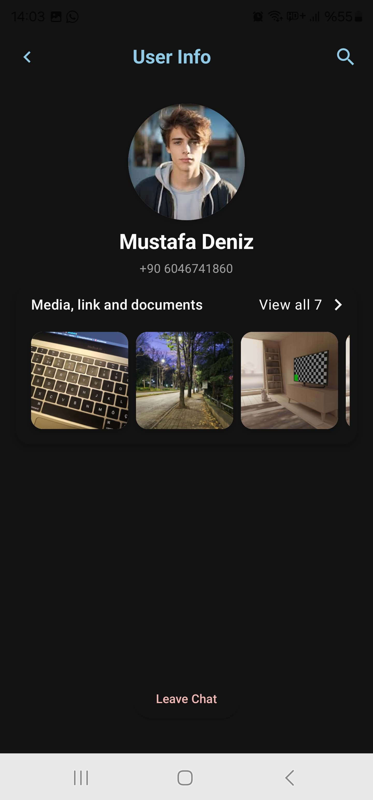

# 📱 **BluChat**  
  

---

### 🔖 **About the Project**  
BluChat is a user-friendly chat application that enables users to register, manage their profiles, and customize application settings. Designed with modern architectural principles (Clean Architecture, MVVM), it is developed using Jetpack Compose to provide a seamless and interactive messaging experience.

---

### 🎥 **App Demo Video**  
Experience BluChat in action by watching the demo video below:  
[](https://youtube.com/shorts/iZQc0c0ZJo4?feature=share)  
*Click the thumbnail to watch the video on YouTube.*

---

### 🖥 **Screenshots**  

| **Screen**                  | **Light Mode**                          | **Dark Mode**                          | **Description** |
| --------------------------- | --------------------------------------- | --------------------------------------- | -------------------------------------------------- |
| **Chat Screen**             |             |             | The main screen where users can view and send messages. |
| **Profile Screen**          |        |        | A screen where users can view and edit their profile information and pictures. |
| **Contacts Screen**         |      |      | A screen to view and manage contact lists. |
| **Message Screen**          |        |        | A screen displaying individual message conversations. |
| **User Info Screen**        |     |     | A screen for viewing and editing detailed user information. |
| **Starred Messages Screen** |  |  | A screen showing all starred (important) messages. |

---

### 🚀 **Features**  

| **Feature**                | **Description**                   |
| --------------------------- | ---------------------------------- |
| **User Authentication**    | Firebase Authentication implemented. |
| **Profile Update**         | Edit profile picture and user information. |
| **State Management**       | Built with MVVM architecture and StateFlow. |
| **Countdown Timer**        | Custom visual countdown timer implementation. |

---

### 🛠 **Technologies Used**  

| Technology           | Description                          |
| --------------------- | ------------------------------------ |
| **Kotlin**           | Programming language                |
| **Jetpack Compose**  | UI development framework            |
| **Firebase**         | User authentication and database    |
| **Clean Architecture** | Layered architecture structure     |
| **Dagger Hilt**      | Dependency Injection (DI) framework |
| **Retrofit**         | REST API operations                 |

---

### 📂 **Folder Structure**  

Project folder structure:

```plaintext
📂 BluChat  
📂  data  
├── 📂  remote            # API service files  
├── 📂  local             # Room or Shared Preferences  
└── 📂  repository        # Repository implementations  
📂  domain  
├── 📂  model             # Model classes  
├── 📂  repository        # Interfaces  
└── 📂  use_case          # UseCase classes  
📂  presentation  
├── 📂  screens           # Screens' UI and ViewModels  
├── 📂  components        # Reusable UI components  
└── 📂  navigation        # Navigation graph setup  
📂  utils                 # Helper files (extensions, constants, etc.)  
└── 📄 build.gradle          # Gradle dependencies
